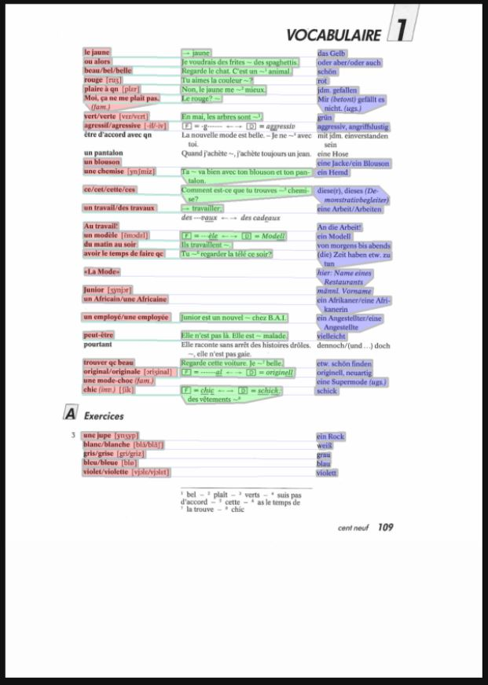

# voki
a command line based tool for vocabulary training

pipeline:
 * scan your french textbok from school
 * run it through the azure OCR service
 * do some pandas magic
 * match french words with german translations & example sentences 

